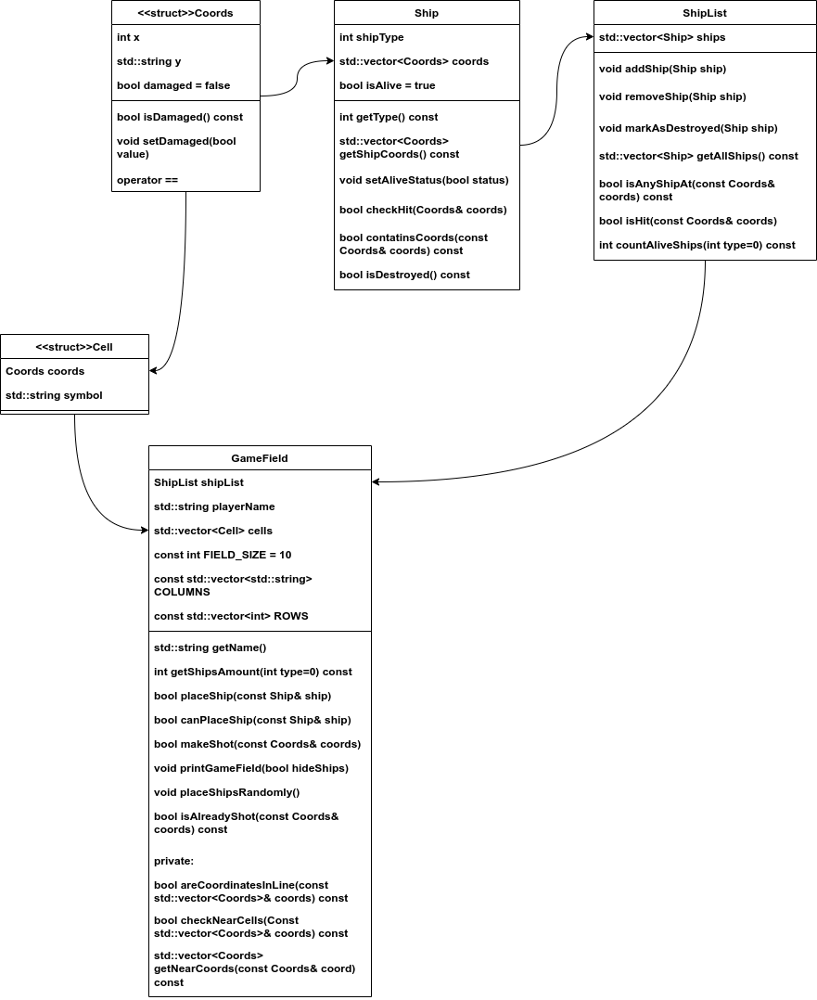

ПОЯСНИТЕЛЬНАЯ ЗАПИСКА

Игра "Морской бой"

СТРУКТУРА ПРОЕКТА

Проект реализует игру "Морской бой" и состоит из следующих сущностей:

1. СТРУКТУРА COORDS (Coords.h)
Представляет координаты на игровом поле.

Поля:
- int x - номер строки (1-10)
- std::string y - буква столбца (A-J) 
- bool damaged - флаг повреждения ячейки

Методы:
- Конструкторы по умолчанию и с параметрами
- isDamaged() - проверка повреждения
- setDamaged() - установка флага повреждения
- operator== - сравнение координат

2. СТРУКТУРА CELL (Cell.h)
Представляет ячейку игрового поля.

Поля:
- Coords coords - координаты ячейки
- std::string symbol - символ для отображения

Методы:
- Конструктор с параметрами coords и symbol

3. КЛАСС SHIP (Ship.h, Ship.cpp)
Представляет корабль на игровом поле.

Поля:
- int shipType - тип корабля (1-4 палубы)
- std::vector<Coords> coords - координаты корабля
- bool isAlive - статус корабля (жив/уничтожен)

Методы:
- getType() - получение типа корабля
- getShipCoords() - получение координат корабля
- setAliveStatus() - установка статуса жизни
- checkHit() - проверка попадания и нанесение урона
- containsCoords() - проверка принадлежности координат кораблю
- isDestroyed() - проверка уничтожения корабля

4. КЛАСС SHIPLIST (ShipList.h, ShipList.cpp)
Управляет списком кораблей игрока.

Поля:
- std::vector<Ship> ships - вектор кораблей

Методы:
- addShip() - добавление корабля
- removeShip() - удаление корабля
- markAsDestroyed() - пометка корабля как уничтоженного
- getAllShips() - получение всех кораблей
- isAnyShipAt() - проверка наличия корабля в координатах
- isHit() - проверка попадания и нанесение урона
- countAliveShips() - подсчет живых кораблей по типу

5. КЛАСС GAMEFIELD (GameField.h, GameField.cpp)
Основной класс, представляющий игровое поле игрока.

Поля:
- ShipList shipList - список кораблей
- std::string playerName - имя игрока
- std::vector<Cell> cells - ячейки поля
- константы размера поля и координат

Публичные методы:
- getName() - получение имени игрока
- getShipsAmount() - получение количества кораблей
- placeShip() - размещение корабля
- canPlaceShip() - проверка возможности размещения
- makeShot() - выполнение выстрела
- printGameField() - отображение поля
- placeShipsRandomly() - случайное размещение кораблей
- isAlreadyShot() - проверка повторных выстрелов

Приватные методы:
- areCoordinatesInLine() - проверка линейности координат
- checkNearCells() - проверка окружающих ячеек
- getNearCoords() - получение соседних координат

UML-ДИАГРАММА:

ЛОГИКА ИГРОВОГО ПРОЦЕССА

Игра состоит из следующих фаз:

1. ИНИЦИАЛИЗАЦИЯ
- Ввод имен игроков или выбор игры против компьютера
- Создание объектов GameField для двух игроков
- Определение очередности размещения кораблей
- Инициализация файла истории игры

2. ФАЗА РАЗМЕЩЕНИЯ КОРАБЛЕЙ
- Ручное размещение для человека (manualShipPlacement)
- Возможность автоматического размещения для игрока
- Автоматическое размещение для компьютера (computerShipPlacement)
- Проверка корректности размещения согласно правилам

Правила размещения:
- 4 однопалубных корабля
- 3 двухпалубных корабля  
- 2 трехпалубных корабля
- 1 четырехпалубный корабль
- Корабли не должны касаться друг друга
- Корабли должны располагаться на прямой линии

3. БОЕВАЯ ФАЗА
- Случайный выбор начинающего игрока
- Поочередные ходы игроков
- Ввод координат для стрельбы или команда "ПОДСКАЗКА"
- Проверка попадания/промаха с логированием
- При попадании - дополнительный ход
- Проверка условий победы
- Сохранение истории игры в файл

___

Полностью реализованные компоненты:
- Структура классов и их взаимодействие
- Ручное размещение кораблей для человека
- Автоматическое размещение кораблей для игрока
- Случайное размещение кораблей для компьютера
- Отображение игрового поля
- Логика стрельбы и проверки попаданий
- Корректная обработка уничтожения кораблей
- Проверка правил размещения кораблей
- Функция generateComputerShot() - случайные выстрелы компьютера
- Запись истории игры в файл
- Обработка победы и завершения игры
- Защита от повторных выстрелов по одной клетке

Стратегия компьютера:
В текущей реализации компьютер использует простую стратегию случайных выстрелов с защитой от повторных атак по уже обстрелянным клеткам. В дальнейшем необходима разработка более практичной системы - например, стратегии Hunt/Target

В разработке:
- Реализация фаз стратегии Hunt/Target для более умного поведения компьютера
- Добавление шахматного паттерна стрельбы в фазе "Hunt"
- Добавление процесса обстрела близлежащих клеток после попадания

___

В данный момент игра полностью функциональна и готова к использованию.
